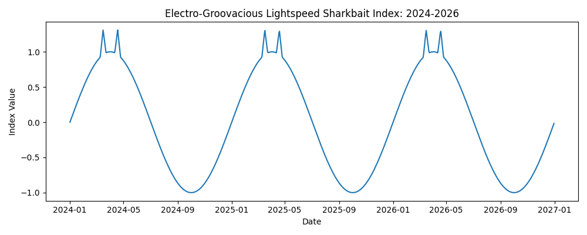
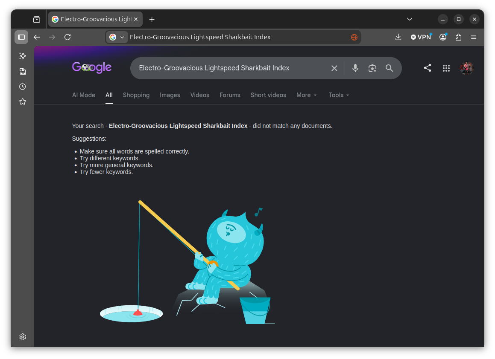
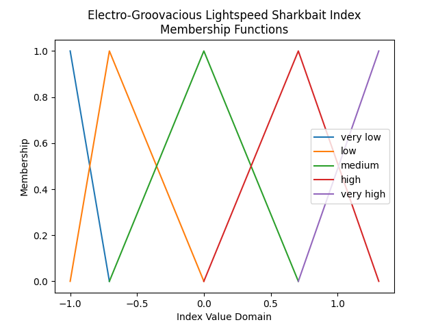
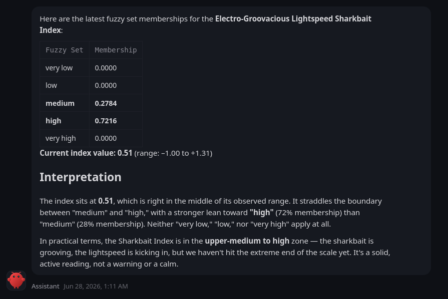

Introducing the "Electro-Groovacious Lightspeed Sharkbait Index"

# Introduction

Expectation and absurdity both hold sacred positions in the scientific reasoning toolkit. Here we apply these techniques to assess whether a fuzzy logic-based agentic AI skill is producing reasonable output.

However, to prepare the argument presented below, we first need to consider the use by scientists of experimental controls and *Reductio ad absurdum*:
# Experimental Controls

Consider what happens when a patient gets tested for allergies. A practitioner injects a series of common allergens just under the patient's skin in a grid pattern across their back. If they are allergic to one or more of these allergens, their skin at that grid location will react (usually by turning red). Makes sense.

But the question remains, "react with respect to what?". Maybe the skin at reddened locations is simply reacting to the needle pricks rather than the particular allergens themselves. We might try to negate this concern by suggesting that any skin reaction to needle pricks would be uniform across the test grid, and therefore cancel out in the final results, but honestly we have no way of actually knowing that such a response would prove uniform across the given patient's skin.

Enter *controls*, both positive and negative:

To answer the question "react with respect to what?" when assessing possible allergen reactions in the test results, we need the following data:

* How does the skin react to a needle prick injecting something absolutely no patient would ever be allergic to?
* How does the skin react to a needle prick injecting something ***every*** patient is allergic to?

Moreover, we would want this information at several, well distributed locations on the patient's back to account for possible spacial variation in skin reaction.

What we are talking about here are *experimental controls*, test cases with expected outcome that a scientist or a test practitioner can evaluate observed measurements with respect to. We further divide controls into "negative" and "positive" controls, which we have already described intuitively above without using these labels.
#### Negative Controls

Absolutely no person on Earth is allergic to water. So when water is injected as a control during an allergy test the practitioner knows what the patient's baseline reaction to a needle prick is. The observed response for these test locations indicates the verified "allergy absent" condition.

Here the use of water serves as a "negative control" for the experiment. Negative controls indicate what happens when *nothing* is supposed to happen. If instead *something* happens, the experimenter knows either they made a procedural mistake, a confounding variable (such as a needle prick) is impacting outcome and must be accounted for during the post-experimental analysis, or that the basic theory behind the hypothesis being interrogated is flawed.
#### Positive Controls

Everyone on the planet shows an allergic reaction when exposed to histamine, as histamine is the exact chemical signal that tells our bodies to initiate allergic responses. As a result, histamine is injected as a control during allergy tests to inform the practitioner what a known allergic reaction looks like, even if the reaction is also impacted by the needle prick that delivered the chemical. The observed response at these locations in the test grid indicates what the known "allergy present" condition looks like.

Here the use of histamine functions as a "positive control" for the experiment. Positive controls indicate what happens with *something* is expected to happen. If instead *nothing* happens, the experimenter knows either they made a procedural mistake, a confounding variable is impacting outcome and must be accounted for, or that the basic theory behind the hypothesis being tested is incorrect.
#### Evaluation with Respect to  the Expected Responses

If, during an experiment such as an allergy test, the positive and negative controls behave as expected, then we can accurately consider non-control experimental observations (such skin reactions to individual test allergens) with respect to the boundaries defined by the control observations.
# *Reductio ad Absurdum*

Like controls, the strategic use of absurdity can also benefit scientific inquiry:

*Reductio ad absurdum* (Latin for "reduction to the absurd") is a method for disproving an argument by demonstrating that that argument, when taken to its logical extreme, results in a contradiction or otherwise impossible outcome. For example, one might disprove a mathematical postulate by proving that it ultimately reduces, after a series of calculations, to a declaration that "one equals zero". Likewise one might disprove a physics hypothesis by showing that it ultimately suggests that "up equals down" or "in equals out".

In the exposition that follows, we will not use *Reductio ad adsurdum* directly to support any particular argument. Rather we use the method's existence to inspire and add validity to what we are really up to: *using absurdity to design effective experimental controls*.
# What We Are Trying to Determine

We have a homegrown agentic AI tool that retrieves a "fuzzified" assessment of the VIX market volatility indicator. Here is an example conversation held within OpenClaw that calls the tool and interprets the results:

The tool's configuration states that VIX is a market indicator of volatility, so it is no surprise that the LLM discusses it as such.

Our concern is whether the LLM's interpretation of the fuzzy set memberships is distorted by what the LLM already knows about VIX. We can see that the LLM is applying prior knowledge about VIX's meaning within its commentary, but when it discusses the fuzzy classification itself the tool appears to only rely on the tool's fuzzy set memberships...

...but we cannot be certain.

The downstream process we intend to use this tool for requires that only the tool's fuzzy set classification be treated as "canon"; any additional interpretation provided by the LLM is to be considered apocryphal to our immediate cause.

So we need to ensure an LLM can work effectively with fuzzy set classifications when it knows nothing about the measurement it is evaluating.

To accomplish this, we define a measurement index so ***absurd*** and novel in its constitution that an LLM could not possibly have been trained on any prior information regarding it. We then alter our fuzzy VIX tool to instead work with this absurd index to see how it behaves.
#  The Electro-Groovacious Lightspeed Sharkbait Index

We hereby introduce the Electro-Groovacious Lightspeed Sharkbait Index, which looks like a sine wave with cat ears, and which attempts to summarize the market relationship between Jupiter’s orbit and the number of pineapple slices on Oregon pizzas during every third leap-year.

Before continuing, we verify that no LLM could have learned about this index during its training phase by assuming that if Google doesn't know about it, then no LLM training set would have known about it beforehand:

Here the absurd index functions as a *negative control*; because the LLM doesn't know about it, and because the index name is nonsensical, we can assume that any interpretation of index values from the fuzzy set memberships delivered by the modified tool emerge completely from the tool's output.

The fuzzy set memberships defined for this index as evaluated by the modified tool are defined as follows:

To test the overall idea, we initiate a conversation, analogous to the VIX conversation presented above, in OpenClaw that calls the modified agentic AI tool:

We see that the resulting fuzzy classification description relies solely on the tool's output. While the LLM does riff linguistically on the intentionally nonsensical index name—"the sharkbait is grooving, the lightspeed is kicking in"—it really has no clue what the index value actually means. As a result this riffing emits completely from the fuzzy set membership result and not any prior LLM knowledge beyond extremely rough definitions of the words contained within the index's name.

Our interpretation of this result is that the LLM is likely to pass the concluded fuzzy set classification to downstream tools without confounding embellishment.

Future analysis will test this interpretation after we build the downstream process we have in mind.
# Code

* [Fuzzy Electro-Groovacious Lightspeed Sharkbait Index MCP Tool](https://github.com/badass-data-science/AI-ML/tree/main/agentic-AI/Skills/negative-controls-for-LLM-testing/absurd-index)
* [Fuzzy VIX MCP Tool](https://github.com/badass-data-science/AI-ML/tree/main/agentic-AI/Skills/trading/vix-fuzzy-mcp-skill)

The version of these MCP tools used at the time of this post's writing is recording in GitHub as commit number [3c9bbabab4c110e24426629226919669da958359](https://github.com/badass-data-science/AI-ML/commit/3c9bbabab4c110e24426629226919669da958359).
# AI Use Statement

The prose you read above was 100% human-generated. The agentic fuzzy logic tools involved in the discussing (which will be detailed in a later post), were human-designed and then implemented with assistance from Claude Code and ChatGPT 5.5.
# Tags

science
data science
absurdity
reductio ad absurdum
fuzzy logic
fuzzy reasoning
AI
AI engineering
agentic AI
AI tools
LLM
OpenClaw
VIX
volatility
Electro-Groovacious Lightspeed Sharkbait Index
