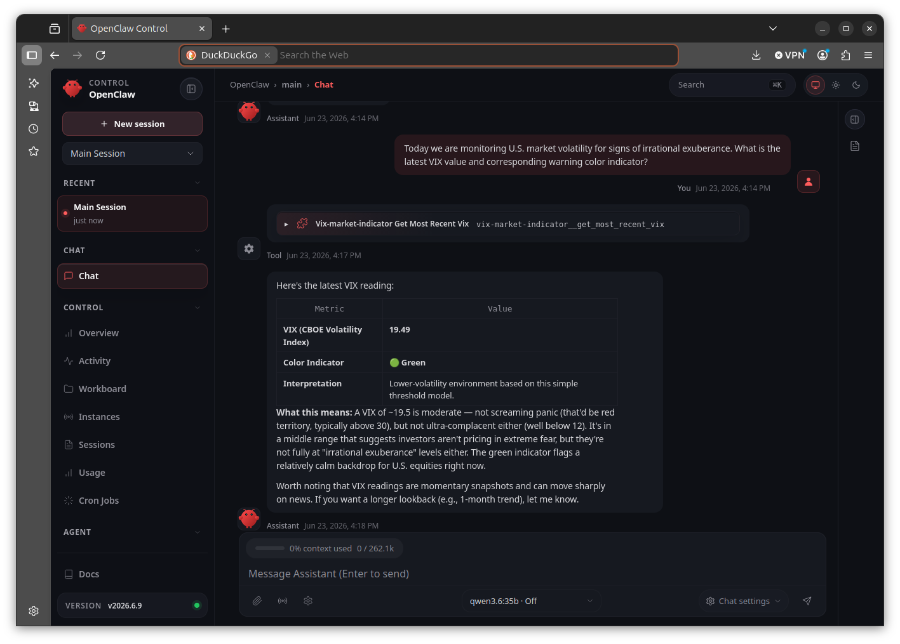

Our heroine the data scientist is creating an army of AI agents to help her take over the world. However, before vibe-coding her army of minions into existence she wants to understand how Model Context Protocol (MCP) works. Moreover, she knows that the best way to learn this subject to the depth she requires is to code up an MCP server from scratch.

Being an evil genius, our heroine requires regular updates on market volatility to know how stressed everyone is. The Chicago Board Options Exchange's Volatility Index, or "VIX" for short, provides this information during U.S. business hours.

She starts with the following basic no-frills Python function, with no error trapping or type enforcement, that retrieves the most recent VIX index value from Yahoo Finance and then assigns a color-based warning level to that value:

```python
import yfinance as yf

def retrieve_most_recent_VIX():

    # retrieve the most recent VIX value from Yahoo Finance
    history = yf.Ticker('^VIX').history(period='7d')
    vix = history['Close'].dropna().iloc[-1]

    # assign a color-based warning level indicator to the value
    if vix >= 30.:
        color = 'red'
    elif vix >= 20.:
        color = 'yellow'
    else:
        color = 'green'

    return vix, color
```

Here red indicates high volatility and green indicates low volatility, with yellow in the middle. In the future our heroine will reorganize these classes into fuzzy sets, but that discussion is for a later post.

Her cunning master plan is to convert this into an MCP tool that she can pilot via OpenClaw.
# Model Context Protocol (MCP)

MCP is standard for connecting LLM models to software tools and data systems. Despite being originally developed by Anthropic before being open-sourced, the protocol is model-agnostic.

While the standard describes other connective functionality, we focus here on the ability of MCP servers to provide ***tools*** (e.g., software functions) to LLMs that the LLMs can actively identify and call. For example, one might build an MCP server that provides an LLM with the means to count the number of beans in a jar given appropriate optical input, should that LLM "decide" it needs to perform this task.

But how would the LLM know whether it "wants" to run such a tool? Well, the tool is annotated in the MCP server with a natural language description of what that tool does, along with natural language instructions indicating how to use it. The LLM then ingests these linguistic descriptions into its context, allowing the model to use natural language to estimate whether the particular tool can help it conduct its given task.

Note that only the tool's description and instructions need be linguistic, the process the tool actually executes can theoretically include any algorithm under the sun and be etched directly onto silicone (though it is more likely to be written in Python or TypeScript). The processing portion of the tool needs only to take input in JSON format, and output the same.
# Making a Python Function Available as a Tool

The FastMCP Python framework allows specification of which function from a body of code to make available to the LLM through the framework's MCP server. This is accomplished using the ```@mcp.tool()``` decorator. For example, here is the final VIX retrieval and classification function, sans tangential function definitions, QA, and class definitions which were left out to facilitate clear presentation:

```python
@mcp.tool()
def get_most_recent_vix(period: str = "7d") -> VixResult:
    """
    Retrieve the most recent VIX close and classify it using a simple color indicator.

    Args:
        period: Yahoo Finance history period to request. Common examples include
            '1d', '5d', '7d', '1mo', '3mo', '6mo', and '1y'.

    Returns:
        A structured VIX result containing the latest close, color indicator,
        and plain-English interpretation.

    Notes:
        This tool is informational only and is not financial advice.
    """

    # Get recent VIX history
    symbol = "^VIX"
    history = yf.Ticker(symbol).history(period=period)

    # Retrieve the close prices and remove missing values
    closes = history["Close"].dropna()

    # Retrieve the most current VIX as the last entry in the close
    # price column
    #
    vix = float(closes.iloc[-1])

    # Classify the VIX into a warning-level color group
    color = classify_vix(vix)

    # Organize result according to the above-defined schema and return.
    # This class definition is not shown here but it ensures the output
    # is valid JSON:
    #
    return VixResult(
        symbol=symbol,
        period=period,
        vix=vix,
        color_based_interpretation=color,
        interpretation=explain_color(color),
    )
```

Importantly, FastMCP uses the function's docstring and function type hints to generate the linguistic description of the tool for LLMs' consideration.

The complete version of this code, tested using OpenClaw, is available [here](https://github.com/badass-data-science/AI-ML/tree/main/agentic-AI/Skills/trading/vix-mcp-skill).
# The Tool In Action


# Next Steps

Our heroine will next attempt to combine agentic AI with fuzzy logic, for the sheer hell of mixing two completely different types of AI together to see if the concoction explodes.

# Tags

Model Context Protocol
MCP
FastMCP
Agentic AI
AI Skill
Agent Skill
LLM
AI
Python
OpenClaw
VIX
Volatility

