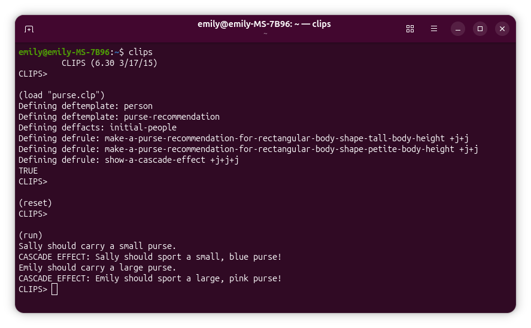

# CLIPS Purse Recommendation Expert System

This project demonstrates a small rule-based expert system written in CLIPS. The system recommends a purse size for each person based on their height and body shape, then shows a second rule firing as a cascade effect.

The content below is LLM-generated:

## Overview

The program defines two main fact templates:

* `person`: stores information about a person, including name, height, favorite color, and body shape.
* `purse-recommendation`: stores the purse size recommended for a person.

The system includes rules that:

1. Match people with a rectangular body shape.
2. Recommend a purse size based on height.
3. Assert a new `purse-recommendation` fact.
4. Use that new fact to trigger another rule that prints a color-specific recommendation.

This demonstrates a basic forward-chaining expert system: one rule creates new facts, and those new facts can activate additional rules.

## Files

Assuming the CLIPS code is saved as:

```text
purse.clp
```

the file contains:

* Template definitions using `deftemplate`
* Initial facts using `deffacts`
* Rules using `defrule`

## Code Structure

### Person Template

```clips
(deftemplate person
  (slot name (type SYMBOL))
  (slot height (type SYMBOL))
  (slot favorite-color (type SYMBOL))
  (slot body-shape (type SYMBOL))
)
```

This template defines a structured fact for each person.

Example person fact:

```clips
(person
  (name Emily)
  (height tall)
  (favorite-color pink)
  (body-shape rectangular))
```

### Purse Recommendation Template

```clips
(deftemplate purse-recommendation
  (slot purse-size (type SYMBOL))
  (slot for-whom (type SYMBOL))
)
```

This template stores the recommendation produced by the rules.

Example recommendation fact:

```clips
(purse-recommendation
  (purse-size large)
  (for-whom Emily))
```

### Initial Facts

The initial data is placed inside a `deffacts` construct:

```clips
(deffacts initial-people
  (person
    (name Emily)
    (height tall)
    (favorite-color pink)
    (body-shape rectangular))

  (person
    (name Sally)
    (height petite)
    (favorite-color blue)
    (body-shape rectangular))
)
```

Using `deffacts` is important when loading a `.clp` file with `load`. Top-level `assert` commands are valid interactively, but they are not valid as constructs inside a file loaded with `load`.

The facts inside `deffacts` are placed into working memory when you run:

```clips
(reset)
```

## Rules

### Tall Rectangular Body Shape Rule

```clips
(defrule make-a-purse-recommendation-for-rectangular-body-shape-tall-body-height
  (person
    (name ?n)
    (height tall)
    (body-shape rectangular))
  =>
  (printout t ?n " should carry a large purse." crlf)
  (assert (purse-recommendation
    (purse-size large)
    (for-whom ?n)))
)
```

This rule matches any person who is:

* tall
* rectangular in body shape

It prints a recommendation and asserts a new `purse-recommendation` fact.

### Petite Rectangular Body Shape Rule

```clips
(defrule make-a-purse-recommendation-for-rectangular-body-shape-petite-body-height
  (person
    (name ?n)
    (height petite)
    (body-shape rectangular))
  =>
  (printout t ?n " should carry a small purse." crlf)
  (assert (purse-recommendation
    (purse-size small)
    (for-whom ?n)))
)
```

This rule matches any person who is:

* petite
* rectangular in body shape

It recommends a small purse.

### Cascade Rule

```clips
(defrule show-a-cascade-effect
  (purse-recommendation
    (purse-size ?q)
    (for-whom ?n))
  (person
    (name ?n)
    (favorite-color ?c))
  =>
  (printout t "CASCADE EFFECT: " ?n " should sport a " ?q ", " ?c " purse!" crlf)
)
```

This rule demonstrates a cascade effect.

It fires after a `purse-recommendation` fact has been asserted by one of the earlier rules. It combines the purse size recommendation with the person’s favorite color to print a more specific recommendation.

For example, if the system knows:

```clips
(person
  (name Emily)
  (favorite-color pink))
```

and a previous rule asserts:

```clips
(purse-recommendation
  (purse-size large)
  (for-whom Emily))
```

then this rule can print:

```text
CASCADE EFFECT: Emily should sport a large, pink purse!
```

## How to Run

Start CLIPS, then load the file:

```clips
(load "purse.clp")
```

Reset the environment so the facts from `deffacts` are inserted into working memory:

```clips
(reset)
```

Run the rule engine:

```clips
(run)
```

The full command sequence is:

```clips
(load "purse.clp")
(reset)
(run)
```

## Expected Output

The output should look similar to:

```text
Sally should carry a small purse.
CASCADE EFFECT: Sally should sport a small, blue purse!
Emily should carry a large purse.
CASCADE EFFECT: Emily should sport a large, pink purse!
```

The exact order may vary depending on CLIPS conflict resolution, but both people should receive purse recommendations, and both recommendations should trigger the cascade rule.

## Important Note About `assert`

When working interactively in CLIPS, you can type commands such as:

```clips
(assert (person (name Emily) ...))
```

However, when loading a `.clp` file with:

```clips
(load "purse.clp")
```

CLIPS expects top-level constructs such as:

* `deftemplate`
* `deffacts`
* `defrule`

That is why the initial facts should be written inside `deffacts`, not as standalone top-level `assert` commands.

## Concepts Demonstrated

This example demonstrates several core expert system ideas:

* Structured facts using `deftemplate`
* Initial fact loading using `deffacts`
* Pattern matching in rules
* Variable binding with `?n`, `?q`, and `?c`
* Rule actions using `printout`
* Asserting new facts from rules
* Cascading rule activation
* Forward chaining

## Summary

This CLIPS program is a simple expert system that makes purse recommendations. It first uses person facts to recommend a purse size, then uses the newly asserted recommendation facts to trigger a second rule that adds the person’s favorite color to the recommendation.

## Example Terminal Output


